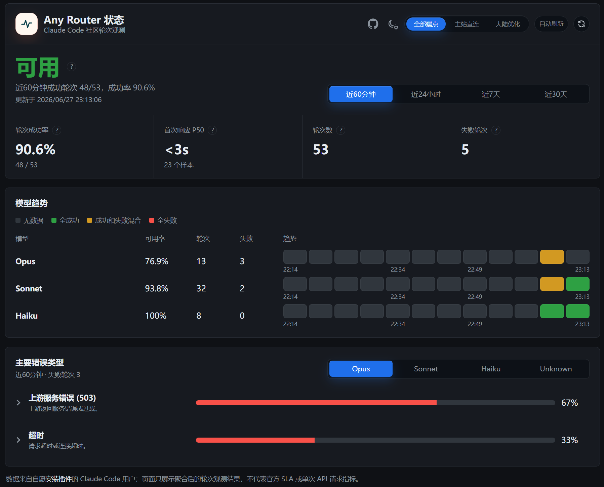

# Any Router Status Monitor

[English](README.en.md)

一个 Claude Code 插件，用来监测 Any Router 当前状态。

单账号反复探测容易触发上游风控、限流甚至封号，而且只代表那一个账号。本插件在每轮结束后匿名上报这轮成功还是失败，汇总成社区状态。

装上即可做出贡献。插件不碰你发往上游的请求，对 Any Router 不留额外特征。

状态页：https://router-vitals.pages.dev/



感谢 [LINUX DO](https://linux.do/) 社区的支持。

## 安装

在 Claude Code 里运行：

```text
/plugin marketplace add Victor-Quqi/router-vitals
/plugin install anyrouter-status-monitor@router-vitals
```

命令行等价：

```bash
claude plugin marketplace add Victor-Quqi/router-vitals
claude plugin install anyrouter-status-monitor@router-vitals
```

装完插件 hooks 就开始工作了。不想参与贡献，设环境变量 `ANYROUTER_STATUS_DISABLED=1` 即可。

### 在状态栏显示状态（推荐）

先找到插件安装路径：

```bash
claude plugin list --json
```

取 `anyrouter-status-monitor@router-vitals` 的 `installPath`，运行：

```bash
node "<installPath>/scripts/setup-statusline.mjs"
```

## 想了解更多

- [上报了什么、怎么保护隐私](docs/reporting.md)
- 自己部署一套：[Cloudflare 配置](docs/cloudflare-setup.md) · [CI/CD](docs/ci-cd.md)
